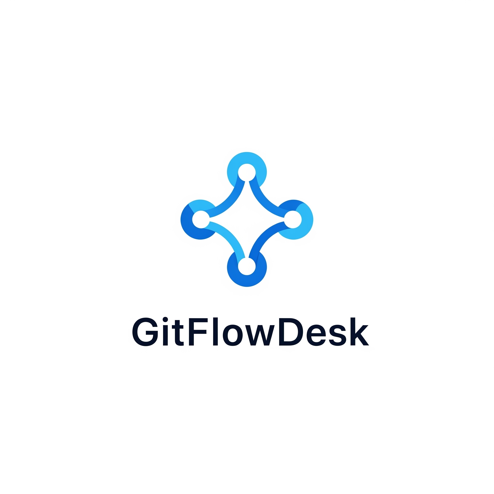

<div align="center">



**A powerful desktop application for exploring GitHub repositories without the browser hassle**

[](https://www.python.org/)
[](https://docs.python.org/3/library/tkinter.html)
[](https://docs.github.com/en/rest)
[](LICENSE)
[]()

---

_Seamlessly browse GitHub repositories, issues, commits, and file structures from your desktop_

</div>

## 🎯 Overview

GitFlowDesk is an intuitive desktop application that brings the essential GitHub repository features to your desktop environment. No more switching between browser tabs or dealing with slow web interfaces - access all the important aspects of any public GitHub repository instantly from a clean, desktop interface.

### ✨ Key Features

- 🔍 **Repository Explorer** - Browse all public repositories for any GitHub user
- 📝 **Issue Tracker** - View repository issues with detailed descriptions
- 📊 **Commit History** - Explore commit messages and SHA hashes
- 🌳 **File Tree Browser** - Navigate repository structure with lazy-loading directories
- 📄 **File Preview** - View file contents directly in the application
- 🔐 **Token Support** - Add access tokens for private repositories and higher rate limits
- 🖥️ **Cross-Platform** - Works on Windows, macOS, and Linux

## 🖼️ Screenshots

<div align="center">

|           Repository View            |          Issue Tracking          |         commits Explorer         |
| :----------------------------------: | :------------------------------: | :------------------------------: |
|  |  |  |

</div>

## 🚀 Quick Start

### Prerequisites

- **Python 3.x** (3.6 or higher recommended)
- **Internet connection** for GitHub API access

### 📦 Installation

1. **Clone the repository**

   ```bash
   git clone https://github.com/kam-stand/GitFlowDesk.git
   cd GitFlowDesk
   ```

2. **Install dependencies**

   ```bash
   pip install requests
   ```

   > **Note:** `tkinter` and `base64` are included with Python standard library

3. **Run the application**
   ```bash
   python3 gui/app.py
   ```
   Or on Windows:
   ```cmd
   python gui/app.py
   ```

### 🔧 Dependencies

GitFlowDesk uses minimal dependencies for maximum compatibility:

| Package    | Purpose                     | Installation           |
| ---------- | --------------------------- | ---------------------- |
| `tkinter`  | GUI Framework               | Built-in with Python   |
| `requests` | HTTP requests to GitHub API | `pip install requests` |
| `base64`   | File content decoding       | Built-in with Python   |

## 📖 Usage Guide

### 1. **Getting Started**

- Launch the application
- Enter a GitHub username in the text field
- Click "Load Repositories" to fetch all public repos

### 2. **Exploring Repositories**

- Select any repository from the list
- The application automatically loads:
  - Repository issues
  - Recent commits
  - File/folder structure

### 3. **Browsing Files**

- Navigate the file tree in the "Content" tab
- Click on folders to expand them (lazy-loading)
- Select files to preview their content

### 4. **Using Access Tokens** (Optional)

For private repositories or higher rate limits, you can modify the code to include your GitHub token in request headers:

```python
headers = {
    'Authorization': 'token YOUR_GITHUB_TOKEN',
    'Accept': 'application/vnd.github.v3+json'
}
```

## 🏗️ Architecture

```
GitFlowDesk/
├── gui/
│   └── app.py          # Main application file
├── LICENSE             # MIT License
└── README.md          # This file
```

### 🔧 Technical Details

- **GUI Framework**: Tkinter with ttk for modern widgets
- **API Integration**: GitHub REST API v3
- **Architecture**: Single-file desktop application
- **Data Handling**: JSON parsing with requests library
- **File Encoding**: Base64 decoding for file contents

## 🌟 Features Breakdown

### 📋 Repository Tab

- Lists all public repositories for a given user
- Real-time loading with error handling
- Clickable repository selection

### 🐛 Issues Tab

- Displays repository issues with titles
- Shows detailed issue descriptions
- Scrollable interface for large issue lists

### 📈 Commits Tab

- Tree view of recent commits
- SHA hash and commit message display
- Sortable columns for better organization

### 📁 Content Tab

- Hierarchical file/folder browser
- Lazy loading for performance
- File content preview pane
- Support for various file types

## 🚧 Roadmap

- [ ] **Authentication UI** - Built-in token management
- [ ] **Search Functionality** - Find files and commits quickly
- [ ] **Syntax Highlighting** - Code preview with proper formatting
- [ ] **Pull Request Support** - View and manage PRs
- [ ] **Bookmarks** - Save favorite repositories
- [ ] **Offline Mode** - Cache repository data locally
- [ ] **Dark Theme** - Modern dark mode interface

## 🤝 Contributing

We welcome contributions! Here's how you can help:

1. **Fork** the repository
2. **Create** a feature branch (`git checkout -b feature/amazing-feature`)
3. **Commit** your changes (`git commit -m 'Add amazing feature'`)
4. **Push** to the branch (`git push origin feature/amazing-feature`)
5. **Open** a Pull Request

### 🐞 Bug Reports

Found a bug? Please open an issue with:

- **Description** of the problem
- **Steps to reproduce**
- **Expected vs actual behavior**
- **System information** (OS, Python version)

## 📄 License

This project is licensed under the MIT License - see the [LICENSE](LICENSE) file for details.

## 🙏 Acknowledgments

- **GitHub** for providing an excellent REST API
- **Python community** for amazing libraries
- **Tkinter** for cross-platform GUI capabilities

## 📞 Support

- 📧 **Email**: [Your Email]
- 🐛 **Issues**: [GitHub Issues](https://github.com/kam-stand/GitFlowDesk/issues)
- 💬 **Discussions**: [GitHub Discussions](https://github.com/kam-stand/GitFlowDesk/discussions)

---

<div align="center">

**Made with ❤️ for the developer community**

⭐ **Star this repo if you find it useful!** ⭐

</div>
